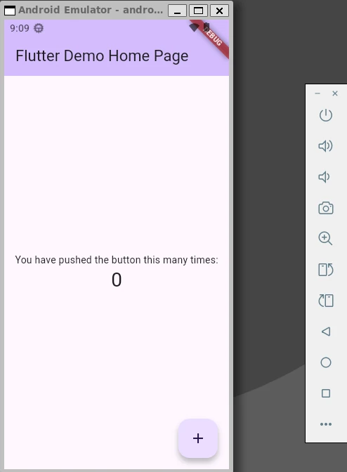

# flutter-devcontainer-template

このプロジェクトでは以下を設定しています。

- Dev Container  
  Docker コンテナを利用した flutter 開発を行います。  
  ローカル環境ではなく Docker を利用した開発環境を構築できるため、ローカル環境を汚す事がありません。

## 環境

- Windows 11
- WSL2(Ubuntu)
- Docker  
  docker / docker-compose on WSL2(Ubuntu)
- VSCode
- DevContainer

上記環境で確認しています。Docker Desktop ではなく apt にて docker-ce をインストール

プロジェクトは WSL2 上のディレクトリに配置してください。  
Windows 上だと正しく機能しない場合があります。docker-ce on WSL2 の制限のようです。

## 手順

1. WSL2(Ubuntu) を実行します。
2. プロジェクトを作成するための適当なディレクトリに移動します。

```shell
cd ~
mkdir my-projects
cd my-projects
```

3. このプロジェクトを clone してください

```shell
git clone <git-url>
```

4. プロジェクトのルートディレクトリに移動します

```shell
cd flutter-devcontainer
```

5. VSCode を開きます

```shell
code .
```

6. VSCode が開いたら、左下の `>< WSL:Ubuntu` をクリックし、`Reopen in Container` を実行します。  
Dockerfile を利用したコンテナのビルドには時間がかかります。コービーブレイクでもして待ちましょう。☕

7. 初回は Dockerfile を利用したコンテナのビルドが行われ、ビルド終了後に `postCreateCommand` で指定した `flutter doctor` 実行されます。
( `TERMINAL` に表示される )

8. 終了後は TERMINAL はコンテナ上のシェルに接続された状態になっています。ここから flutter 開発に必要な操作を行う事が可能です。

初回の flutter doctor 実行時に最新版ではないので flutter upgrade しろというメッセージが出力される場合があります。  
必要に応じてアップグレードしてください。

---

## Flutter プロジェクトの作成

コンテナのシェルから flutter コマンドを実行します。  
※ <projectname> は任意のプロジェクト名

```shell
flutter create <projectname>
```

```shell
cd <projectname>
flutter pub get
cd ..
chmod -R 777 ./<projectname>
```

後は作成されたプロジェクト内で flutter アプリケーションの開発が行えます。

---

## エミュレーターの起動

### android

```shell
emulator @android33 -no-metrics
```

Emulator が起動してきますが、現状いくつか警告がでます。  
DevContainer で実行するときの制約もあるようです。

- ハードウェアアクセラレーションはうまく動いていないようで、SwiftShader（ソフトウェアレンダリング）を使っている

```shell
WARNING      | Your GPU drivers may have a bug. Switching to software rendering.
```

- Vulkanのライブラリが見つからず、ソフトウェアレンダリングにフォールバックしている

```shell
SharedLibrary::open for [/root/android-sdk/emulator/qemu/linux-x86_64/lib64/vulkan/libvulkan.so] failed
```

- Pulseaudio の接続失敗（音声は出ない可能性）

```shell
pulseaudio: pa_context_connect() failed
```

ADBのdevice offline警告もあるが、エミュレータ自体は起動完了

```shell
adb: device offline
```

※ 最初はエラーで起動しなかったために、
`devcontainer.json` に以下を追加しています。
```json
  "runArgs": [
    "--device", "/dev/kvm"
  ]  
```


## flutter アプリケーションの実行


必要に応じて別ターミナルを使ってください。

※ これもそれなりの時間がかかりますので、待ちましょう。  
※ 上記 エミュレーターが 起動した状態で実行しましょう。

```shell
flutter run
```

アプリが起動すると、エミュレータ上で実行されます。



## apk ビルド

```shell
flutter build apk --release
```

---

## デバッグ

VSCode からデバッグする場合、この状態からだとそのままデバッグする事ができませんでした。  
これは VSCode がプロジェクトのルートディレクトリに `pubspec.yaml` が存在する場合には Dart/Flutter のプロジェクトとして認識するためらしい。

今回の手順では DevContainer に接続してから flutter create project を実行しているため flutter プロジェクトはサブディレクリに格納されており、`pubspec.yaml` は VSCode のプロジェクトルートにはありません。

どうするか迷った末、以下の手順で VSCode からインタラクティブデバッグする事に成功しました。  
もっとよい手順もあるかもしれません。あれば教えてください。

1. TERMINALウィンドウで flutter プロジェクトディレクトリに移動する
```shell
cd <projectname>
```
2. 移動したディレクトリで VSCode を開く
```shell
code .
```
3. 別ウィンドウで VSCode が開く、Dev Container に接続されている状態である事を確認する。  
※ 左下に `>< Dev Container: Flutter Dev Container` の表示がある
4. TERMINAL のカレントディレクトリが <projectname> ディレクトリ直下になっているので、ここからエミュレータを起動する。
```shell
emulator @android33 -no-metrics
```
5. `lib/main.dart` の適当な個所にブレークポイントを設定する。  
私は 60 行目辺りの `void _incrementCounter()` メソッド内で設定しました。これでカウントアップボタンクリック時にブレークするはず。
6. main.dart を開いた状態で、VSCode 左メニューの `Run and Debug` アイコンをクリックする。
7. `Run and Debug` ボタンが表示されるのでクリックする。デバッグ実行が開始されるはず。初回は何か質問してきたかもしれないので、適切そうな選択肢を選ぶ :-p
8. エミュレータ上でアプリが実行される。
10. アプリ右下の `＋` ボタンをクリックする。
以下 `_counter++;` にブレークポイントを設定していれば、ブレークされる。
```dart
 void _incrementCounter() {
    setState(() {
      // This call to setState tells the Flutter framework that something has
      // changed in this State, which causes it to rerun the build method below
      // so that the display can reflect the updated values. If we changed
      // _counter without calling setState(), then the build method would not be
      // called again, and so nothing would appear to happen.
      _counter++;
    });
  }
```
11. `_counter` を Add to Watch すれば、カウンタ値がカウントアップするのを確認できる。

以上、簡単ですがデバッグ実行も行える事が確認できました。

---

## トラブル

### SSLException

`flutter run` 実行時に SSLException が発生した事がありました。  
この時は再実行したら発生せず。接続が不安定とか?

```shell
# flutter run
Launching lib/main.dart on Android SDK built for x86 64 in debug mode...
Exception in thread "main" javax.net.ssl.SSLException: Received fatal alert: bad_record_mac
        ... ( 以下略 )
```

---

## まとめ

デバッグ実行する場合は、ちょっと面倒ですが、flutter-devcontainer 開発用のプロジェクトを一つ作成しておけば、このプロジェクト下にプロジェクトを作成して開発が行える (複数でも可) なので、この構成はこの構成でありな気がします。

気に入らないという方は自分で構成変更する等してみてください。
